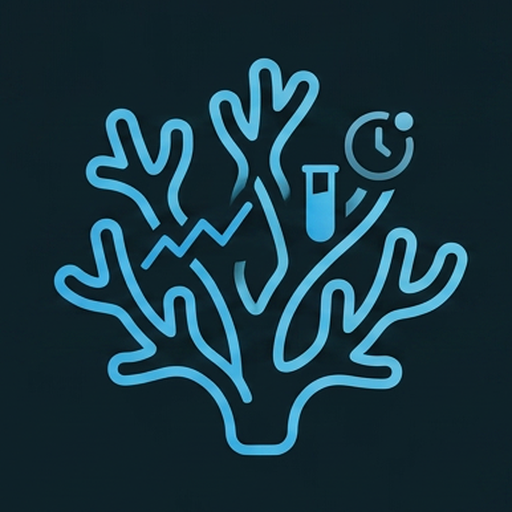
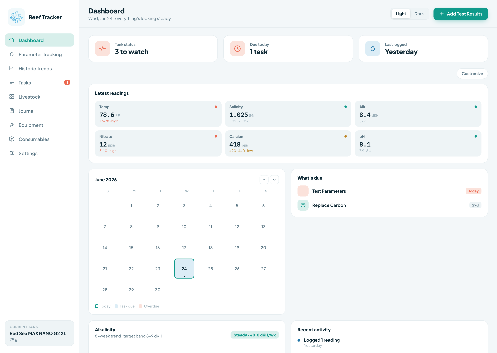
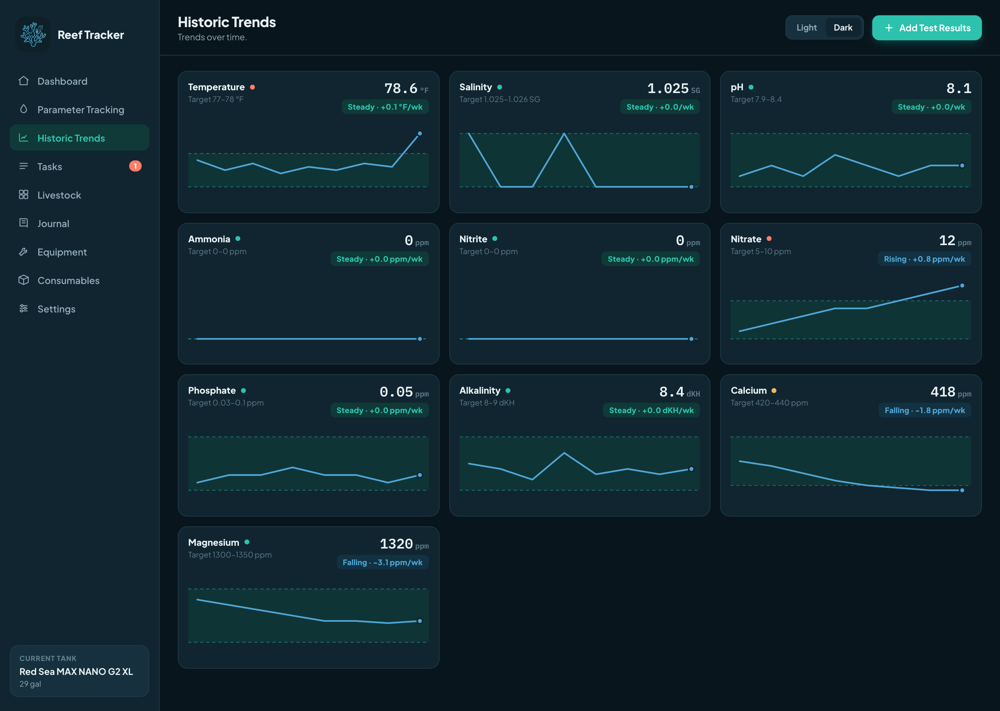
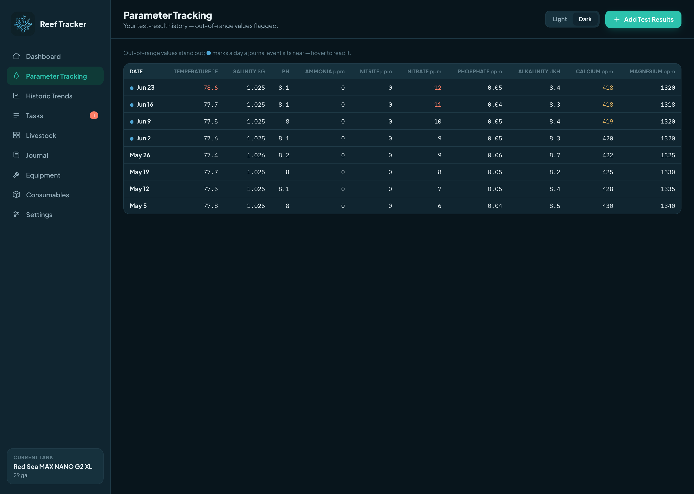

<p align="center">
  
</p>

<h1 align="center">🐠 Reef Tracker</h1>

<p align="center">
  Your self-hosted reef tank companion — log water chemistry, watch trends against
  target ranges, stay on top of maintenance, and keep an honest record of every
  fish, frag, and water change. 🪸
</p>

<p align="center">
  <strong>Python · FastAPI · SQLModel · SQLite · APScheduler · React (Vite) · Docker</strong>
</p>

---

## ✨ Features

### 🧪 Water chemistry
- **Parameter logging** — dated, multi-value entry; record a whole test session at once.
- **Editable history grid** — click any value to edit it, click an empty cell to backfill a result, or delete a bad day's row entirely. ✏️
- **Trends & charts** — per-parameter line charts with the target-range band shaded and a simple rising/falling/steady trend.
- **Out-of-range flags** — readings outside your target band stand out everywhere they appear. 🚩
- **Configurable parameters** — add parameters, set target ranges, or retire ones you don't track.

### 🔧 Maintenance & reminders
- **Recurring tasks** — daily / weekly / biweekly / monthly / as-needed; marking one done recomputes the next due date automatically. ✅
- **"What's due" dashboard** — live task list, a due-today count, and a sidebar badge so nothing slips.
- **Checklists** — step-by-step procedures (e.g. water change) you follow along with so no step gets skipped. 📋
- **Notifications** — email (SMTP) and push (ntfy), checked on a schedule and sent once per due cycle. 🔔
- **iCal feed** at `/calendar.ics` — subscribe in Google or Apple Calendar and your recurring tasks show up automatically. 📅

### 🐟 Livestock & journal
- **Livestock gallery** — add/edit with type filters, life status (alive / lost / removed), and per-animal detail. 📸
- **Photo uploads** — stored on the data volume, served read-only; the database only keeps the path.
- **Honest stocking advice** — a transparent, advisory-only rules layer (in friendly LFS voice) flags bioload, aggression, and compatibility concerns as you stock — and never blocks you.
- **Journal** — a dated timeline of everything that happened in the tank.

### ⚙️ Equipment & live integration
- **Equipment register** — track the gear running your tank: brand, model, and notes.
- **Red Sea ReefBeat integration** — pull **live status** from your devices on the LAN: 💡
  - 🔆 **ReefLED** · 💧 **ReefATO+** · 🌊 **ReefWave** · ⚗️ **ReefDose**
- **Equipment status on the dashboard** — at-a-glance cards (intensity, reservoir level, online/offline) from a background poller.

### 📊 Customizable dashboard
- **Fixed KPI row** — tank status (computed from out-of-range readings), tasks due today, and last-logged at a glance.
- **Drag-your-own layout** — add, remove, reorder, and resize widgets (one- or two-column span); your layout is saved per tank. 🧩
- **Widget catalog:**
  - 📈 **Latest readings** · 📅 **Task calendar** · 🗓️ **What's due** · 📉 **Parameter chart** (pick the parameter)
  - 💡 **Insight preview** · 🕑 **Recent activity** · 📋 **Checklists** · ⚙️ **Equipment status**
- **Recent activity feed** — merges readings, completed tasks, journal entries, and livestock additions into one timeline.
- **"Worth a look" insight** — a transparent, rule-based nudge toward whatever needs attention.

### 🐙 Multi-tank
- **Track multiple systems** — the whole data model is multi-tank from the ground up; switch tanks from the sidebar and every screen (readings, tasks, livestock, equipment, dashboard layout) follows along.

### 🎨 Look & feel
- **Light & dark themes** — toggle any time. 🌗
- **Responsive layout** — works from a desktop down to the phone you're holding over the tank. 📱

### 🛡️ Your data, your machine
- **Self-hosted** — one Docker service, SQLite in a named volume. No cloud account, no telemetry.
- **Automatic backups** — the app snapshots the database before every migration, so an upgrade can never lose your history.
- **In-house migrations** — lightweight, forward-only schema upgrades that just work on launch.
- **Interactive API docs** — full Swagger UI at `/docs` for every endpoint. 🧑‍💻
- **First-launch seed** — boots with a sample mixed-reef tank, parameters, tasks, and 8 weeks of readings so the app is never empty.

---

## 📸 Screenshots

| Dashboard | Historic trends | Parameter grid |
|---|---|---|
|  |  |  |

*Light and dark themes included.* 🌗

---

## 🧰 Tech stack

| Layer | Tech |
|---|---|
| Backend | Python · FastAPI · SQLModel · SQLite · APScheduler |
| Frontend | React (Vite) single-page app |
| Deploy | docker-compose — one service + a named volume |

---

## 🚀 Quick start

### 🐳 Pull from Docker Hub (fastest)

The image is published at [`blackbird4051/reef-tracker`](https://hub.docker.com/r/blackbird4051/reef-tracker) (multi-arch: `amd64` + `arm64`):

```bash
docker run -d -p 8000:8000 -v reef-data:/data blackbird4051/reef-tracker:latest
# open http://localhost:8000  (or http://<lan-ip>:8000 from your phone)
```

The SQLite file and uploaded photos live in the `reef-data` named volume —
**back up by copying that volume.** 💾

### Build it yourself (production-style, one service)

```bash
docker compose up --build
# open http://localhost:8000
```

### Local dev (two processes)

**Backend:**

```bash
cd backend
python3 -m venv .venv && .venv/bin/pip install -r requirements.txt
REEF_DATA_DIR=./data .venv/bin/uvicorn app.main:app --reload --port 8000
```

**Frontend** (Vite dev server proxies `/api` → `localhost:8000`):

```bash
cd frontend
npm install
npm run dev      # http://localhost:5173
```

📚 Interactive API docs: http://localhost:8000/docs

---

## 🔔 Notification config

All optional — unset channels are simply skipped. Set as environment variables
(e.g. in `docker-compose.yml`):

| Var | Channel | Notes |
|---|---|---|
| `SMTP_HOST`, `SMTP_TO` | Email | required pair to enable email |
| `SMTP_PORT` / `SMTP_USER` / `SMTP_PASS` / `SMTP_FROM` / `SMTP_TLS` | Email | optional (port 587, TLS on by default) |
| `NTFY_TOPIC` | Push | enables ntfy; `NTFY_URL` defaults to `https://ntfy.sh` |
| `REEF_BASE_URL` | iCal | absolute base for the advertised feed URL |
| `REEF_CHECK_INTERVAL` | Scheduler | due-check interval in seconds (default 3600) |

---

## 🗂️ Project layout

```
backend/app/          FastAPI app
  routers/            tanks, parameters, readings, tasks, checklists, activity,
                      livestock, journal, photos, equipment, dashboard, calendar (iCal)
  integrations/       Red Sea ReefBeat client + background device poller
  recurrence.py       cadence -> next-due computation
  notifications.py    SMTP + ntfy senders (env-driven)
  scheduler.py        APScheduler due-task check + device polling
  livestock_advice.py transparent stocking-advice rules (LFS voice)
  backup.py           pre-migration DB snapshots
  migrations.py       lightweight in-house schema migrations
  seed.py             first-launch seed data
frontend/src/         React SPA — pages/, components/, api.js, TankContext
Dockerfile            multi-stage: build SPA, serve it + the API from one Python image
docker-compose.yml    one service + reef-data volume (SQLite + /photos)
```

---

## 🗺️ Roadmap

- 🧴 **Consumables tracking** → usage-based reorder reminders.
- 📈 **Advisory trend flags** → gentle, transparent suggestions from consumption rates (never dosing amounts).
- 📱 **Mobile & hosting** → cloud deploy and a personal iPhone app via TestFlight — see [MOBILE_AND_HOSTING_ROADMAP.md](MOBILE_AND_HOSTING_ROADMAP.md).

Full plan in [REEF_TRACKER_SPEC.md](REEF_TRACKER_SPEC.md).
